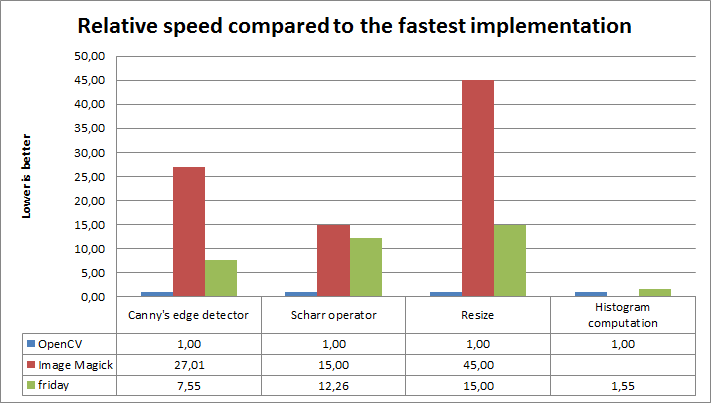

*Friday* is an image processing library for Haskell. It has been designed to be
fast, generic and type-safe.

*friday* also provide some simple computer vision features such as edge
detection or histogram processing.

Except for I/Os, *friday* is entirely written in Haskell.


# Features

The library uses FFI calls to the *DevIL* image library (written in C) to read
images from a wide variety of formats, including BMP, JPG, PNG, GIF, ICO and
PSD.

The library currently supports four color-spaces: RGB, RGBA, HSV and gray-scale
images. Images can be converted between these color-spaces.

At this moment, the following features and algorithms have been implemented:

* various image transformations: resizing, cropping, vertical and horizontal
[flop/flipping](http://en.wikipedia.org/wiki/Flopped_image) and
[flood fill](http://en.wikipedia.org/wiki/Flood_filling) ;

* filters:
[morphological transformations](http://en.wikipedia.org/wiki/Mathematical_morphology)
(dilation and erosion), blurring (mean
and [Gaussian](http://en.wikipedia.org/wiki/Gaussian_blur) blurs) and
derivative computation
([Sobel](http://en.wikipedia.org/wiki/Sobel_operator) and
[Scharr](http://en.wikipedia.org/wiki/Sobel_operator#Alternative_operators)
operators) ;

* support for mutable and masked images ;

* both adaptive and non-adaptive thresholding ;

* edge detection using
[Canny's algorithm](http://en.wikipedia.org/wiki/Canny_edge_detector) ;

* color histograms (including comparisons and image equalization).

# Quick tour

## The Image type-class

Images implement the `Image` type-class.

This type-class give you, among other things, the `index` and the `shape`
methods to look up for pixel values and to get the image size.

## Manifest and Delayed images

To benefit from Haskell's purity, non-mutable images are represented in two
ways:

* the `Manifest` representation stores images in Haskell `Vector`s. `Grey`,
`HSV`, `RGB` and `RGBA` are *manifest* images ;

* the `Delayed` representation uses a function to produce image pixels. These
images can be efficiently chained to produce complex transformations. With some
inlining, Haskell compilers are able to produce fast algorithms by removing
intermediate structures when working with delayed images.
`GreyDelayed`, `HSVDelayed`, `RGBDelayed` and `RGBADelayed` are *delayed*
images.

The `convert` method from the `convertible` package can be used to convert
images between color-spaces and representations.

As most functions work with both representations and all color-spaces, you need
to help the type checker to choose the correct return type.

For example, if you want to convert an RGBA image to a greyscale image, use a
type annotation to inform the compiler the image type you want to get:

```haskell
toGrey :: RGBA -> Grey
toGrey = convert
```

When you only need to force the returned representation of a function, you can
use the `delayed` and `manifest` functions. These functions don't do anything
except enforcing types.

```haskell
makeMiniature = delayed . resize Bilinear (ix2 150 150)
```

See [this file](example/Delayed.hs) for an example of a pipeline of delayed
images.

## Storage images

When you use the `load` function to read an image from a file, the returned
image is a `StorageImage`:

```haskell
data StorageImage = GreyStorage Grey | RGBAStorage RGBA | RGBStorage RGB
```

Before using an image loaded from a file, you need to convert it into an usable
representation such as RGB:

```haskell
toRGB :: StorageImage -> RGB
toRGB = convert
```

## Masked images

Some images are not defined for each of their pixels. These are called masked
images and implement the `MaskedImage` type-class.

The `MaskedImage` type-class primarily gives you a `maskedIndex` method which
differs from `index` by its type :

```haskell
index       :: Image i       => i -> Point -> ImagePixel i
maskedIndex :: MaskedImage i => i -> Point -> Maybe (ImagePixel i)
```

Unlike `index`, `maskedIndex` doesn't always return a value. For convenience,
every `Image` instance is also a `MaskedImage` instance.

`DelayedMask` can be used to create a masked image.

## Create images from functions

Images are instance of the `FromFunction` type-class. This class provide a
method to create images from a function.

For example, if you want to create a black and white image from another image,
you could write:

```haskell
toBlackAndWhite :: (Image i, Convertible i Grey) => i -> Grey
toBlackAndWhite img =
    let grey = convert img :: Grey
    in fromFunction (shape img) $ \pt ->
            if grey `index` pt > 127 then 255
                                     else 0
```

However, most of the time, you will prefer to use the `map` function instead:

```haskell
toBlackAndWhite :: (Image i, Convertible i Grey) => i -> Grey
toBlackAndWhite img =
    let grey = convert img :: Grey
    in map (\pix -> if pix > 127 then 255 else 0) grey
```

# Examples

* [Apply a Gaussian blur](example/GaussianBlur.hs) ;

* [Compare two images by their color histograms](example/Histogram.hs) ;

* [Create a pipeline of delayed images](example/Delayed.hs) ;

* [Detect edges using Canny's edge detector](example/Canny.hs) ;

* [Resize an image](example/ResizeImage.hs) ;

* [Thresholds an image using the Otsu's method](example/Threshold.hs).

# Benchmarks

The library has been sightly optimized and could be moderately used for
real-time applications.

The following graph shows how the library compares to two other image processing
libraries written in C. The fastest implementation for each algorithm is taken
as reference:



The main reason that performances are currently below OpenCV is that OpenCV
relies heavily on SIMD instructions.
